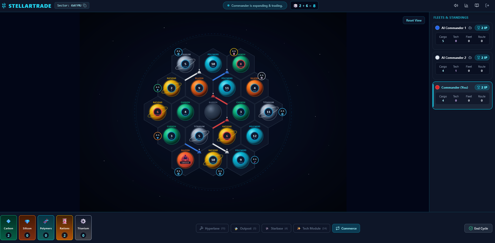

# Stellartrade - Galactic Expansion & Commerce

A modern, production-grade real-time multiplayer space strategy game built with **TypeScript**, **WebSockets**, **React**, and an authoritative game engine. Chart trade routes across star systems, colonize planets with outposts, upgrade fortified starbase citadels, navigate scarce planetary commodities, and compete for supreme dominion over the sector.

---



---

## 🌐 How to Play with Friends Worldwide (100% Free)

Because Stellartrade is built as a **unified full-stack application**, the Node.js server serves both the bundled web client and the real-time WebSocket state machine on a single port. Anyone can connect and play from **any browser** on PC, Mac, tablet, or smartphone — **no installations, no client downloads, and zero cost**.

### 🌟 Method 1: 24/7 Free Cloud Hosting (Recommended: Render.com)
Deploy the game to the cloud in under 2 minutes so you and your friends can access it anytime via a permanent public URL:

1. **Fork or push this repository** to your GitHub account:
   ```bash
   git init
   git add .
   git commit -m "Initial commit of Stellartrade"
   git branch -M main
   git remote add origin https://github.com/YOUR_USERNAME/Stellartrade.git
   git push -u origin main
   ```
2. **Sign up for free at [render.com](https://render.com)** (100% free tier, no credit card required).
3. **Deploy with 1 Click:**
   * In your Render dashboard, click **New +** $\rightarrow$ **Blueprint**.
   * Select your `Stellartrade` GitHub repository.
   * Render automatically reads [`render.yaml`](render.yaml) and configures the build (`npm run build`) and start command (`npm start`).
   * Click **Apply**.
4. **Share with Friends:**
   * Render assigns you a free public HTTPS/WSS address, e.g.:
     `https://stellartrade-live.onrender.com`
   * Send the link to your friends.
   * One player clicks **"Create Sector"** and shares the 6-character Sector Code (e.g. `6WKYMU`).
   * Other players paste the code and click **"Join Sector"**!

---

### ⚡ Method 2: Instant Play Tonight (Free Cloudflare Tunnel - No Cloud Account Needed)
If you have the game running on your own computer and want to play with friends immediately without setting up any cloud accounts or configuring router port forwarding:

1. **Start the game on your computer:**
   ```bash
   npm run build
   npm start
   ```
   *(Server starts at `http://localhost:4000`)*

2. **Open a second terminal window and run Cloudflare's free tunnel:**
   ```bash
   npx cloudflared tunnel --url http://localhost:4000
   ```
3. Cloudflare generates an instant secure public URL, e.g.:
   `https://xyz-random-words.trycloudflare.com`
4. Send the URL to your friends on Discord or WhatsApp. They click the link and join your room immediately!

---

### 🏠 Method 3: Local Network (Same Wi-Fi / LAN Party)
If your friends are in the same room or connected to the same Wi-Fi network:

1. Start the server on your computer:
   ```bash
   npm run build
   npm start
   ```
2. Find your local IP address:
   * **Windows:** run `ipconfig` (e.g. `192.168.1.45`)
   * **Mac/Linux:** run `ifconfig` or `ip a`
3. Tell your friends to navigate to `http://192.168.1.45:4000` in their browser on any device!

---

### 🐳 Method 4: 1-Command Docker Deployment
If you run Docker or a home server:

```bash
docker build -t stellartrade .
docker run -d -p 4000:4000 --name stellartrade stellartrade
```
Access the game at `http://localhost:4000` or behind your reverse proxy (Nginx, Traefik, Caddy).

---

## 🎮 How a Match Works

1. **Lobby & Fleet Assembly:** 3 to 4 commanders join a sector (expandable to 5-6). Solo testing is supported by adding autonomous AI bots with 1 click.
2. **System Founding Cycles:**
   * Each commander deploys 2 initial Outposts and 2 connected Hyperlanes across planetary orbits.
   * Planets bordering your second Outpost yield your initial resource cargo hold.
3. **Command Cycles (Turns):**
   * **Sensor Pulse:** Roll the frequency dice (frequencies 2–12).
   * **Resource Yields:** All celestial planets matching the frequency pulse generate commodities for adjacent Outposts (1 unit) and Starbases (2 units).
   * **Void Corsair Incursions (Frequency 7):** Blockades planetary mining operations, forces fleets with >7 cargo cards to jettison half their haul, and allows raiding rival cargo.
   * **Commerce:** Trade with rivals or trade with the Galactic Reserve via Deep Space Freight (4:1) or Orbital Ports (3:1 / 2:1).
   * **Construction & Tech:** Deploy Hyperlanes, Outposts, Starbases, and strategic Tech Modules (Patrol Frigates, Quantum Synthesis, Trade Embargo, Hyperlane Expansion).
4. **Victory Condition:** The first commander to attain **10 Influence Points (IP)** on their cycle secures galactic hegemony and wins!

---

## 🌟 Highlights & Technical Features

1. **Authoritative Server Architecture:**
   * Node.js + WebSocket (`ws`) state machine server.
   * Full server-side validation: **Orbital Spacing Rule**, construction tariffs, valid coordinate paths, and trade exchange ratios.
   * Real-time delta state synchronization to all connected commanders.

2. **Graph Theory & Planetary Topology:**
   * Pointy-topped hexagonal coordinate grid using axial & cubic coordinate math ($q + r + s = 0$).
   * Canonical hash representation for unambiguous graph topology:
     * Conduits (Hyperlanes): `edge:q1,r1|q2,r2`
     * Orbit Vertices (Outposts/Starbases): `vertex:q1,r1|q2,r2|q3,r3`
   * **Longest Trade Route:** Depth-First Search (DFS) graph traversal with cycle resolution and rival blockade segmentation.

3. **Universe-Based SVG Board:**
   * Smooth mouse wheel zoom, pan & drag across the sector arena.
   * Vibrant 3D-shaded planetary spheres with atmospheric rings and orbital textures:
     * **Arboreal Planets** (Carbon)
     * **Silica Planets** (Silicon)
     * **Hydro Planets** (Polymers)
     * **Agri-Planets** (Rations)
     * **Mineral Planets** (Titanium)
     * **Dead World** (Void Corsair Base)
     * **Deep Space** (Vacuum boundary & Orbital Ports)
   * **Intelligent Placement Guidance:** Visual pulses indicate legal placement locations for Outposts, Starbases, and Hyperlanes in real time.

4. **Game Modes & Interfaces:**
   * **Interactive System Charting:** Pre-game tile drafting mode where commanders dynamically build the sector board.
   * **Deep Space Freight & Orbital Ports:** Multi-resource balanced trade calculator supporting 4:1 Universal Depot, 3:1 Universal Orbital Ports, and 2:1 Dedicated Docks.
   * **Fleet-to-Fleet Commerce:** Direct player trading modal with proposals, counter-offers, and multi-player consensus tracking.
   * **Void Corsair Interception Assistant:** Automatic cargo jettison calculation on frequency 7 with randomized options.
   * **Telemetry & Analytics:** Empirical roll frequency histograms compared against theoretical Gaussian distributions.
   * **Autonomous Fleet Bots:** Solo testing and slot filling with autonomous AI commanders.

5. **Synthesized Web Audio Engine:**
   * Procedural audio synthesizers using Web Audio API for sensor sweeps, construction, trade chimes, and victory fanfares (zero external audio file dependencies, with instant mute toggle).

---

## 🛠️ Local Development

### 1. Install Dependencies
```bash
npm install
```

### 2. Start Development Environment
Launch both client and server concurrently with live-reload:

```bash
npm run dev
```

* **Client:** [http://localhost:3000](http://localhost:3000)
* **Server:** [http://localhost:4000](http://localhost:4000) (WebSocket at `ws://localhost:4000`)

### 3. Run Test Suite
Execute the entire test suite across all workspace packages:

```bash
npm test
```

### 4. Production Build
Compile and bundle all workspaces:

```bash
npm run build
```

---

## 📂 Project Architecture (TypeScript Monorepo)

* [`packages/shared`](packages/shared): Shared domain types, planetary geometry, canonical keys, topology graph, distance validation, and procedural board generation.
* [`packages/server`](packages/server): Authoritative GameEngine FSM, RoomManager (6-character sector codes), bot AI, and WebSocket server.
* [`packages/client`](packages/client): React 18, Vite, Tailwind CSS, SVG planetary board with pan/zoom, audio engine, and HUD control interfaces.

---

## 📜 Galactic Codex & Rulebook
For complete game rules, mechanics, and technical specifications, refer to [`docs/Rules.md`](docs/Rules.md).
